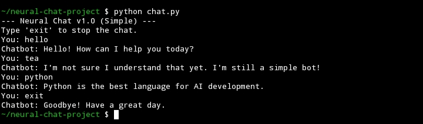

# Simple Neural Chat

A minimalist, rule-based chatbot built entirely within a **Termux** environment using Python. This project serves as a foundational exercise in AI logic and version control.

## 🚀 Features
* **Keyword Recognition:** Responds to specific user intents (greetings, info, python).
* **Fallback Logic:** Handles unknown inputs gracefully.
* **Clean Interface:** Simple command-line loop with an easy exit command.
* **Version Controlled:** Developed step-by-step with clear Git history.

## 🛠️ Requirements
* Python 3.x
* Termux (or any standard terminal)

## 📥 Installation & Usage
1. **Clone the repository:**
   ```bash
   git clone [https://github.com/EngReteti/neural-chat-project.git](https://github.com/EngReteti/neural-chat-project.git)

## 📸 Chatbot Output

